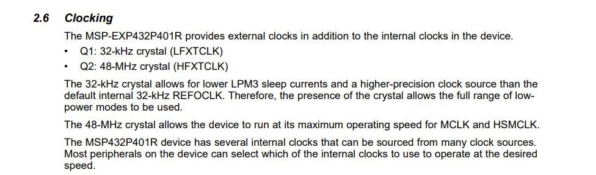
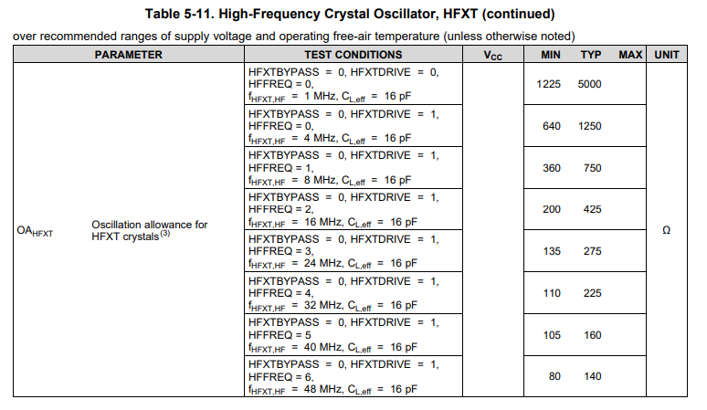
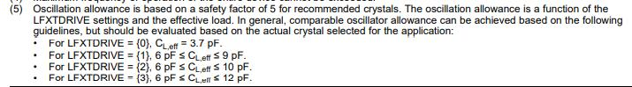

# **MSP432学习过程记录**

**介绍**：

​	该笔记是我学习msp432的学习笔记。目的在于记录自己学习**msp423**时遇到的问题和解决办法，还有对于一些原理性知识的记录，因此可能会比较杂乱无章。记录顺序是按照我开发过程来记录的，例如我进行系统初始化时遇到的问题和学到的知识就会记录在系统初始化的目录下，因此可能看起来会有一些杂乱无章。

​	学习msp432的目的是：为了增强自己对于单片机的了解、尝试学会去阅读数据手册、了解外设的运行原理和底层代码。还有就是为了实验室更新传承代码。（msp430 DOG都不用）

​	希望自己可以坚持下去，基本上在周末的时候进行开发，所以是一周一更（希望如此，乐）

## 第一部分：系统初始化

系统初始化包括：使能FPU、配置时钟源、设置系统核心电压、初始化系统时钟。

### **时钟源**：

MSP432有**六个时钟源** 两个**外部时钟源**，四个**内部时钟源**

1. **外部时钟源**:	
   1. **LFXT**:低速时钟源   最高32.768KHz
   2. **HFXT**:高速时钟源 最高48MHz
2. **内部时钟源**：
   1. **DCO**：数控时钟源 最高48MHz 当外接高精度电阻时，可以提高其精度(其实开发板已经接好了一个高精度电阻，所以直接用DCO时钟源也是可以的，我一开始不知道，后面看了原理图发现已经接好了)
   2. **VLO**(*Very Low-Power Low-Frequency Oscillator*):低功耗低频时钟源 是一个低精度时钟，最高可达 9.4KHz
   3. **REFO**(*Low-Frequency Reference Oscillator*): 低频参考振荡器  可以作为LFXT的替补时钟源，也可以作为普通时钟源 最高可达128KHz
   4. **MODOSC**(*Module Oscillator*):内置的一个高速唤醒时钟。时钟频率固定为25MHz  可用于ADC模块 1Msps采样率
   5. **SYSOSC**(*System Oscillator*):内置的时钟源 固定5MHz. 可用于ADC模块 200ksps采样率 
3. **故障安全机制**：msp432设有故障安全机制，具体可以查看**msp432p401r.pdf**的122页。

​			*ADC的转换速率：完成一次从模拟信号到数字信号的AD转换所需的时间的倒数。*

### **FPU**：

浮点运算单元，配合DSP指令集可以使单片机浮点运算时间大大缩短。（目前还不知道有什么用，以后会慢慢了解）

开启FPU直接调用官方库函数就行。

#### 代码如下：

~~~C
 //开启FPU（float point unit)
    MAP_FPU_enableModule();
~~~


### **配置外部时钟源：**




上图是对两个**外部晶振**的简单介绍以及对应管脚。

可以看到HFXT可以为MCLK和HSMCLK的时钟源，所以我们配置的时候用HFXT作为MCLK和HSMCLK的时钟源

同时可以看到两时钟源的引脚为**PJ.0 PJ.1**和**PJ.2 PJ.3**

#### **代码如下：**

```c
    //配置时钟引脚，使用外部时钟源
    MAP_GPIO_setAsPeripheralModuleFunctionOutputPin(GPIO_PORT_PJ, GPIO_PIN0 | GPIO_PIN1, GPIO_PRIMARY_MODULE_FUNCTION); //Low
    MAP_GPIO_setAsPeripheralModuleFunctionOutputPin(GPIO_PORT_PJ, GPIO_PIN3 | GPIO_PIN2, GPIO_PRIMARY_MODULE_FUNCTION); //High
    MAP_CS_setExternalClockSourceFrequency(32768, 48000000);//设置两个时钟源的频率
```


### 配置核心电压：


如图可知，我们在设置频率前要先更改单片机核心电压。系统默认核心电压为**VCORE0**，48MHz对应的是**VCORE1**

#### 代码如下：

```c
    //改变电源核心电压 必须改变
    MAP_PCM_setCoreVoltageLevel(PCM_VCORE1);
```


### **配置Flash**:

​		参照官方初始化文件，发下官方在系统初始化时配置了Flash。

​		根据下表，我们在更改频率的时候要先更改**FLASH_BANK0**和**FLASH_BANK1**的**WaitState**为**1**


#### **代码如下**：

```c
    /*更改闪存控制器使用的等待状态数用于读取操作。
    当改变时钟频率范围时，必须使此函数可读闪存
    通俗来讲就是CPU跑的太快了，Flash跟不上，让CPU等等它*/   
	MAP_FlashCtl_setWaitState(FLASH_BANK0,1);
    MAP_FlashCtl_setWaitState(FLASH_BANK1,1);
```


### 设置晶体驱动等级：

**HFXT**是无源的，所以不需要驱动。



**LFXT**需要驱动等级为**3** 原因如下：



#### 代码如下：

```c
   //设置晶体驱动等级
    CS_startHFXT(false);    
	//bool CS_startHFXT(bool bypassMode)  HFXT的bypass = 0
    CS_startLFXT(CS_LFXT_DRIVE3); //驱动等级3
	//bool CS_startLFXT(uint32_t xtDrive)  LFXT的xtDRIver = 3
```


### 初始化系统时钟:

将HFXT分配给MCLK和SMCLK

#### 代码如下：

```c
    //初始化系统时钟(MCLK)为48MHZ　初始化子系统时钟为48MHZ
    MAP_CS_initClockSignal(CS_MCLK, CS_HFXTCLK_SELECT, CS_CLOCK_DIVIDER_1);  //48MHz   16分频时，滴答延时可达到最长
    MAP_CS_initClockSignal(CS_SMCLK, CS_HFXTCLK_SELECT, CS_CLOCK_DIVIDER_1); //48MHz
```


### MY_Systeminit():

```c
void MY_Systeminit()
{
    //关闭看门狗
    MAP_WDT_A_holdTimer();

    //开启FPU（float point unit)
    MAP_FPU_enableModule();//使能fpu
    //MAP_FPU_enableLazyStacking();

    //配置时钟引脚，使用外部时钟源
    MAP_GPIO_setAsPeripheralModuleFunctionOutputPin(GPIO_PORT_PJ, GPIO_PIN0 | GPIO_PIN1, GPIO_PRIMARY_MODULE_FUNCTION); //Low
    MAP_GPIO_setAsPeripheralModuleFunctionOutputPin(GPIO_PORT_PJ, GPIO_PIN3 | GPIO_PIN2, GPIO_PRIMARY_MODULE_FUNCTION); //High
    MAP_CS_setExternalClockSourceFrequency(32768, 48000000);//设置两个时钟源的频率

    //改变电源核心电压 必须改变
    MAP_PCM_setCoreVoltageLevel(PCM_VCORE1);

    /*更改闪存控制器使用的等待状态数用于读取操作。
    当改变时钟频率范围时，必须使此函数可读闪存
    通俗来讲就是CPU跑的太快了，Flash跟不上，让CPU等等它*/
    MAP_FlashCtl_setWaitState(FLASH_BANK0,1);
    MAP_FlashCtl_setWaitState(FLASH_BANK1,1);
   
   //设置晶体驱动等级
    CS_startHFXT(false);          
    //bool CS_startHFXT(bool bypassMode)  HFXT的bypass = 0
    CS_startLFXT(CS_LFXT_DRIVE3); //驱动等级3
	//bool CS_startLFXT(uint32_t xtDrive)  LFXT的xtDRIver = 3

    //初始化系统时钟(MCLK)为48MHZ　初始化子系统时钟为48MHZ
    MAP_CS_initClockSignal(CS_MCLK, CS_HFXTCLK_SELECT, CS_CLOCK_DIVIDER_1);  //48MHz   16分频时，滴答延时可达到最长
    MAP_CS_initClockSignal(CS_SMCLK, CS_HFXTCLK_SELECT, CS_CLOCK_DIVIDER_1); //48MHz

}
```


